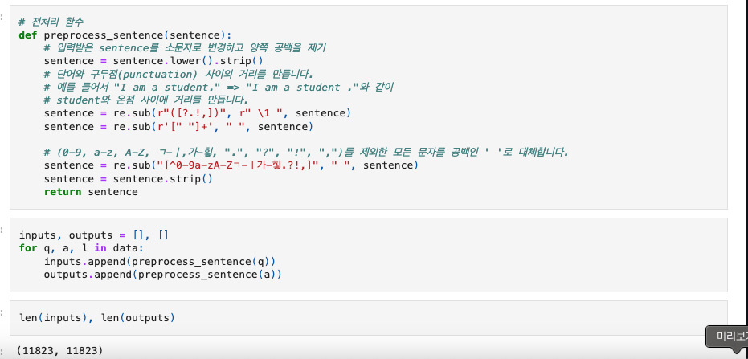
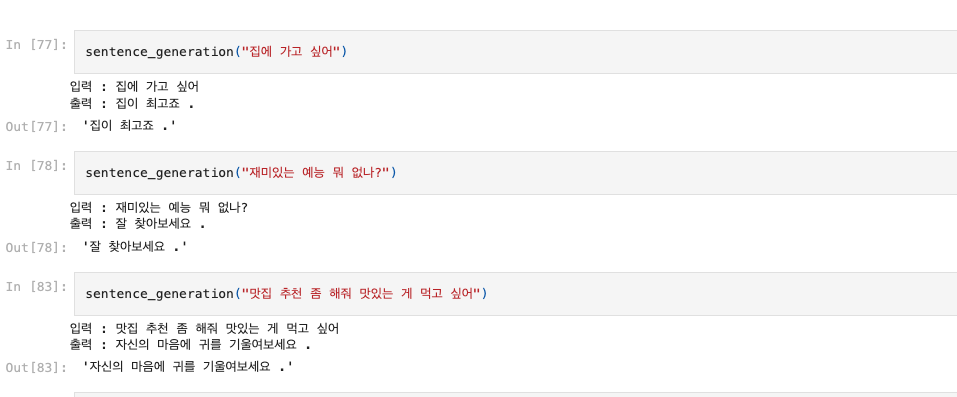
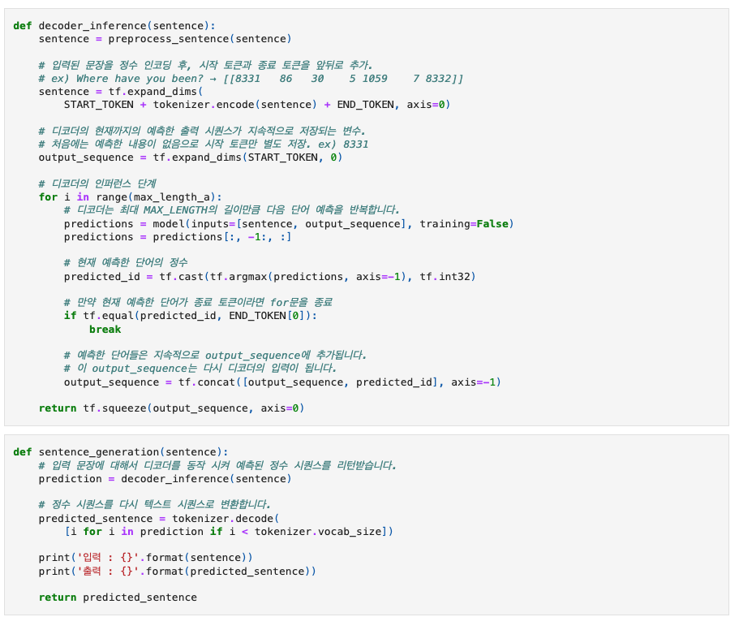
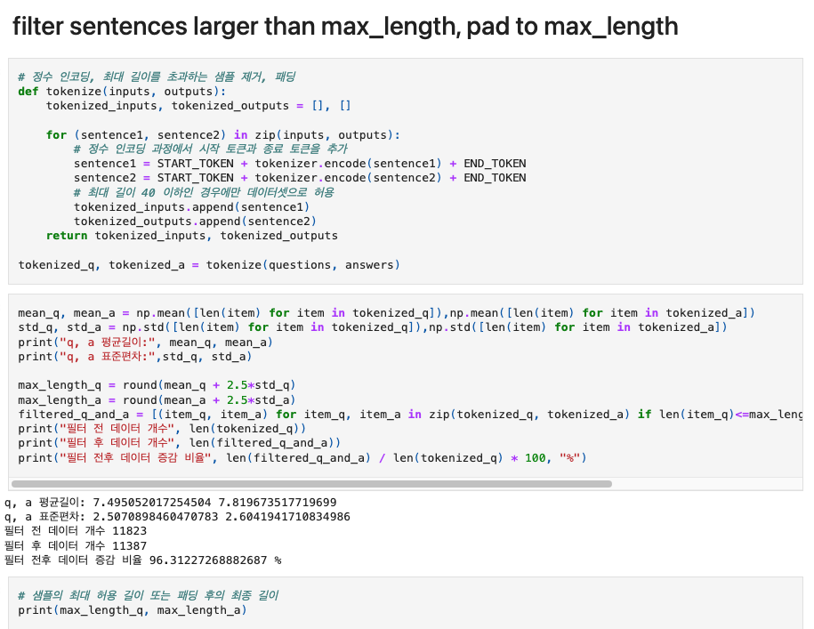
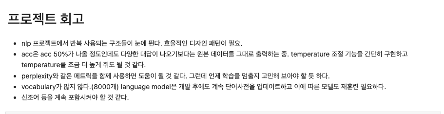

# AIFFEL Campus Online Code Peer Review Templete
- 코더 : 김 인수
- 리뷰어 : 김 영만


# PRT(Peer Review Template)
- [*]  **1. 주어진 문제를 해결하는 완성된 코드가 제출되었나요?**
    - 공백과 특수문자 처리, 토크나이징, 병렬데이터 구축의 과정이 적절히 진행 되었습니다.
        - 
    - 트랜스포머 모델을 구현하여 한국어 챗봇 모델 학습을 정상적으로 진행 되었습니다.
        - 
    - 한국어 입력문장에 대해 한국어로 답변하는 함수를 구현 되었습니다.
        - 

- [*]  **2. 전체 코드에서 가장 핵심적이거나 가장 복잡하고 이해하기 어려운 부분에 작성된 
주석 또는 doc string을 보고 해당 코드가 잘 이해되었나요?**
    - 디코더 레이어에 대한 주석이 잘 작성되어 이해가 잘 되었습니다.
        -     

- [*]  **3. 에러가 난 부분을 디버깅하여 문제를 해결한 기록을 남겼거나
새로운 시도 또는 추가 실험을 수행해봤나요?**
    - 필터 전후 데이터 증감 비율 실험을 하였습니다.
        - 
        
- [*]  **4. 회고를 잘 작성했나요?**
    - 조금 긴 문장은 답변이 명쾌 하지 않는데 그 부분에 대한 해결 접근 방법이 기술이 되어 있어 좋았습니다.
       - 
        
- [ ]  **5. 코드가 간결하고 효율적인가요?**
    - 파이썬 스타일 가이드 (PEP8) 를 준수하였는지 확인
    - 코드 중복을 최소화하고 범용적으로 사용할 수 있도록 함수화/모듈화했는지 확인
        - 중요! 잘 작성되었다고 생각되는 부분을 캡쳐해 근거로 첨부


# 회고(참고 링크 및 코드 개선)
```
코드 전체에 대한 자세한 설명이 이루어져어 더 깊이 이해 할 수 있었습니다.
또한, 회고를 통해 챗봇의 정확성을 높이기 위해 고려해야 할 부분이 언급 되어 있어 좋았습니다.
```
